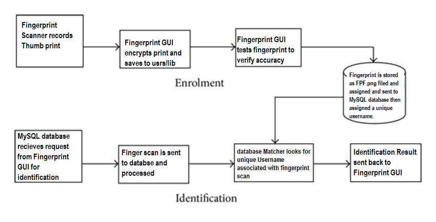
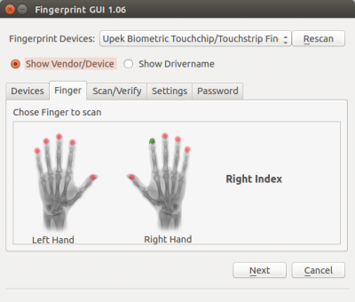
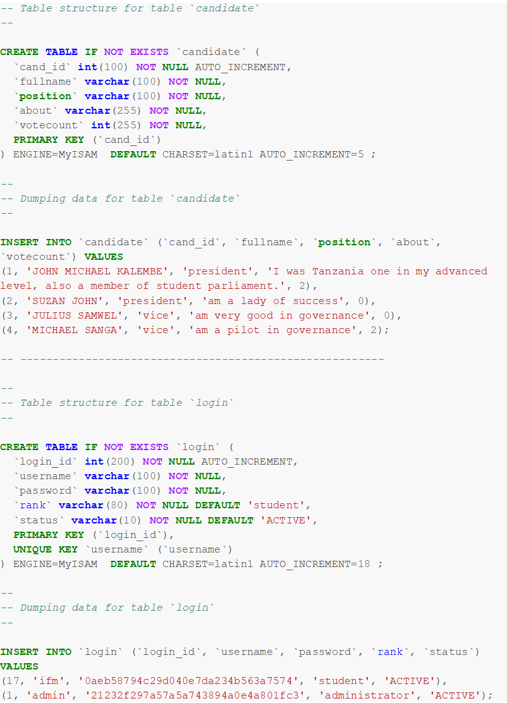

**Introduction:**

With my final project I chose to challenge myself with something I didn&#39;t have much experience in. I chose biometric input to be fed to a voting program using unique identifiers to record which users have voted and which haven&#39;t. I chose a fingerprint scanner as the method of biometric input as I felt it would be the easiest technology to obtain as opposed to facial recognition or eye scanners.

    **Major Objectives:**

- Obtain fingerprint scanner
- Finding open-source software to interpret and record fingerprint patterns
- Develop voting software to interpret fingerprint scans
- Have working database to record fingerprint patterns and assign them to Usernames
- Correlate fingerprint scans to individual votes within voting software
- Allow each user to only vote once and then tally the votes

**Materials Needed:**

- USB Fingerprint scanner
- Ubuntu 17.10 installed
- FingerprintGUI installed
- Open source voting software for mySQL
- Extensive knowledge in SQL and PHP code

**Diagram/Pictures:**

 

(Fingerprint authentication diagram)

 

(Voting software GUI)

 

(Fingerprint GUI finger enrollment screen)

**Sources:**

- FingerprintGUI installation guide:

[**https://launchpad.net/~fingerprint/+archive/ubuntu/fingerprint-gui**](https://launchpad.net/~fingerprint/+archive/ubuntu/fingerprint-gui)

[**https://sourceforge.net/projects/studentsvotingsystem/?source=directory**](https://sourceforge.net/projects/studentsvotingsystem/?source=directory)

**https://www.w3schools.com/php/default.asp**

- Authentication method used by Fingerprint GUI below:

/etc/pam.d/sudo

#%PAM-1.0

**auth                sufficient        pam\_fingerprint-gui.so**

auth                required        pam\_unix.so

auth                required        pam\_nologin.so

/etc/pam.d/su

 #%PAM-1.0

 auth                sufficient        pam\_rootok.so

  **auth                sufficient        pam\_fingerprint-gui.so**

 auth                required        pam\_unix.so

 account                required        pam\_unix.so

 session                required        pam\_unix.so

**Code Examples:**

- Main code used in voting software to query database for voting inputs and verify identification ( this was the one I worked with the most)

 

- I worked with many different files to code this and they are all located in https://sourceforge.net/code-snapshots/git/s/st/studentsvotingsystem/code.git/studentsvotingsystem-code-9fae88c152a5580fa295c8e45c55d8a807008b27.zip

**Reflection:**

 This project proved to be a real challenge as I had to work with multiple programming languages and different open-source applications to attempt it. I learned a lot about Ubuntu and Linux as a whole. The prints are stored as .BIR files  and referenced each time the PAM(Plugin Authentication Module) service is called in Ubuntu. Therefore this method of verification works with most password forms in linux. After I understood how the scanner worked it was on to part two of my project which was correlating the .BIR files to a unique identifier in a database. Much of my gained knowledge came from failed attempts to set-up a MySQL database and feed it information. I worked with languages such as PHP, SQL, and C++ to correlate data between the different applications but after many attempts could now create an environment that would allow the two programs to speak to each other.. I made many mistakes in my attempts and even corrupted the entire filed system of Ubuntu using the chown and chmod terminal commands to attempt to take ownership of the database. I had to completely reinstall Ubuntu which proved to be its own challenge as creating a bootable USB version of Ubuntu is something I hadn&#39;t done before. Learning from this I carefully set-up another database but was unable to get the voting system running properly on it. It was at this point I was forced to simplify the project.

**Conclusion:**

 In conclusion the project was very interesting but also very difficult. I would have chosen an easier topic had I known the complexity of biometric data and how it is verified through a Linux system. I believe I would have been able to achieve my original goal with more time or maybe others to collaborate with.
