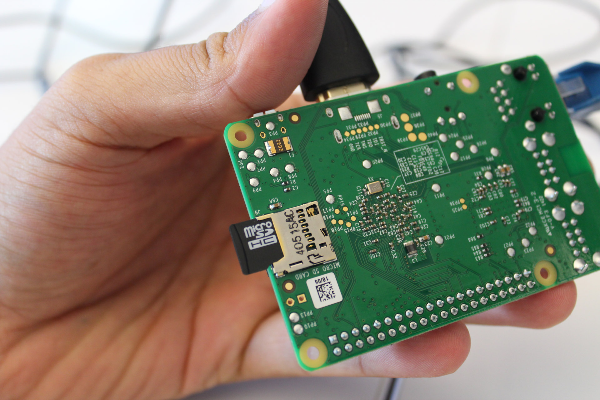

**Goal:** Use Raspberry Pi to host and configure an IRC server.

**Steps:**

-Obtain Raspberry Pi and microSD card

-Download Rasbarian OS onto SD card

-Power on Rasberry Pi and connect to monitor using HDMI

-Boot Rasberry Pi into Rasbarian

-Run update and upgrade commands (sudo apt-get update && sudo apt-get
upgrade –y)Run install command(sudo apt-get install gcc libssl-dev –y)

Download IRC server called UnrealIRCd and install to /usr/bin

Configure the Unreal IRC by navigating to the Unreal folder (cd
Unreal 13.2)then (/Config) command

Change support SSL connections to “Yes”Leave all other settings on default

Genertate SSL certificate and type (make) CD /usr/bing and run unrealircd.conf

Many configurations were made in this file based on online research located in the [raspguide](https://raspguide.wordpress.com/2014/04/14/set-up-your-raspberry-pi-as-an-irc-server/)

Start IRC server using (/unreal start) command

**Sources**

https://raspguide.wordpress.com/2014/04/14/set-up-your-raspberry-pi-as-an-irc-server/

https://www.raspberrypi.org/downloads/raspbian/

**Pictures**

(unrealIRCD loading unrealircd.conf successfully)

(Rasberry Pi fully connected and SD card inserted)

**Risks/Challenges:**

Getting Rasbarian to boot

Finding an easy to configure IRC server that’s compatible with
Rasbarian

Trial and error with different configuration 
settings until it worked

Downloading Rasbarian(long download)

UnrealIRCd not issuing SSL certificate after changing
configuration setting

**Materials Needed:**

Raspberry Pi
Internet Connection
MicroSD card
Sd card reader
Computer to download     

**Conclusion**

This was a good introductory project for getting me used to a Linux operating system. Coming from Windows, Rasbarian OS was very different to me and I struggled at first to use it.  Many of the terminal commands I learned were very valuable and applicable to other applications/installations. The file structure was also something I struggled with at first but managed to overcome by following the guide precisley. I believe I chose a very simple and straight forward guide that made the project much easier to understand.

 

 

 

 

 

